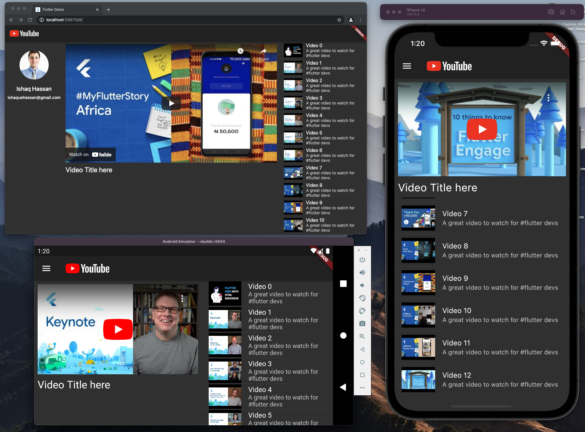

# Youtube Responsive with Flutter 2.0

A responsive youtube app using Flutter 2

## Packages Used

- [Youtube Player Iframe](https://pub.dev/packages/youtube_plyr_iframe)
- [Assets indexer](https://pub.dev/packages/assets_indexer)

## Preview with web, ios & android

For help getting started with Flutter, view our
[online documentation](https://flutter.dev/docs), which offers tutorials,
samples, guidance on mobile development, and a full API reference.